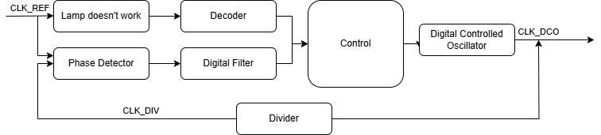

# All-Digital Phase-Locked Loop (ADPLL)

A synthesizable, portable ADPLL design based on standard cells. This project implements a fully digital PLL with coarse/fine frequency tuning and a two-level time-to-digital converter (TDC) for rapid frequency locking.

## Key Specifications
- **Architecture**: Fully digital, synthesizable with standard cells.
- **Process Node**: Portable across nodes
- **Frequency Range**: Configurable via Coarse/Fine Tuning Words (CTW/FTW).
- **TDC Resolution**: Two-level structure (coarse counter + fine delay line)
- **Components**: DCO, TDC, digital filter, phase detector, feedback divider.

## Block Diagram

